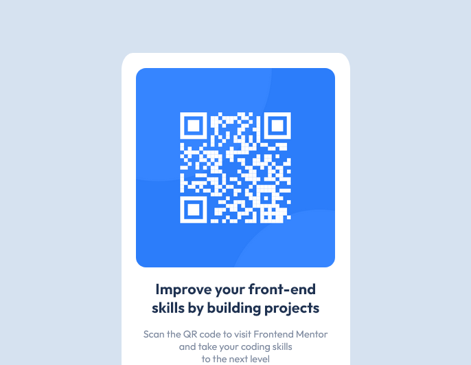

# Frontend Mentor - QR code component solution

This is a solution to the [QR code component challenge on Frontend Mentor](https://www.frontendmentor.io/challenges/qr-code-component-iux_sIO_H). Frontend Mentor challenges help you improve your coding skills by building realistic projects. 

## Table of contents

  - [Screenshot]
  - [Links]
  - [Built with]
  - [What I learned]
  - [Useful resources]
  - [Author]

### Screenshot

```
  
  
```

### Links

- Solution URL: [Add solution URL here](https://your-solution-url.com)
- Live Site URL: [Add live site URL here](https://your-live-site-url.com)


### Built with

- Mobile-first workflow

### What I learned
-(#to make rensposive layouts)
-(#to deploy a project using GitHub Pages)

### Useful resources

- [CRL- Kevin Powell](https://courses.kevinpowell.co/view/courses/conquering-responsive-layouts/278049-day-21-you-ve-done-it/803458-links-to-other-resources) - This helped me making responsive layouts and starting with mobile first.
- [SuperSimpleDev](https://www.youtube.com/watch?v=p1QU3kLFPdg)- This helped me with GitHub Pages.

## Author

- Website - [Add your name here](https://www.your-site.com)
- Frontend Mentor - (https://www.frontendmentor.io/profile/verakissyou17)

